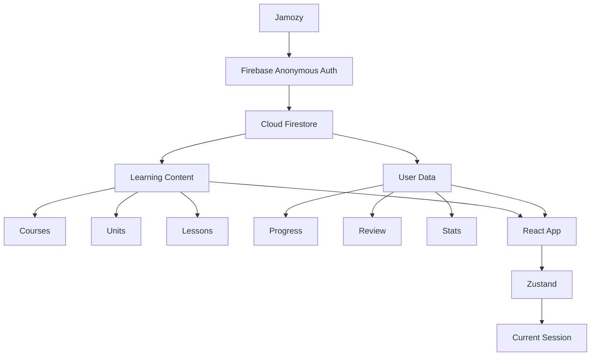

# Jamozy

[](https://react.dev/) [](https://www.typescriptlang.org/) [](https://vite.dev/) [](https://tailwindcss.com/) [](https://firebase.google.com/) [](https://zustand-demo.pmnd.rs/) [](https://motion.dev/) [](https://vitest.dev/) [](https://pnpm.io/) [](https://pages.cloudflare.com/) [](LICENSE)

Jamozy is a web-based Korean typing learning app designed to help learners
become familiar with Hangul and the Korean keyboard through structured practice.

Learners progress from basic characters and syllables to words, phrases,
and sentences while improving typing accuracy and speed.

## Core Features

- Progressive Unit → Lesson learning structure
- Korean typing exercises
- Virtual Korean keyboard guide
- Correct / incorrect typing feedback
- Accuracy and typing speed tracking
- Lesson results
- Review mistyped words
- Practice mode
- Learning progress tracking
- Simple EXP and Level system
- Persistent learning progress with Firebase
- Configurable learning settings

## Learning Flow

Learn → Type → Review → Improve → Unlock

## Initial Scope

The first version focuses on the core Korean typing learning experience.

Firebase Anonymous Authentication is used to identify learners without requiring
a traditional sign-up flow, while Cloud Firestore stores learning content and
user progress.

The MVP does not include multiplayer, leaderboards, social features, or other
competitive systems.

## Tech Stack

Frontend: React + TypeScript + Vite
Styling: Tailwind CSS
Routing: React Router
State Management: Zustand
Backend / BaaS: Firebase
Database: Cloud Firestore
Authentication: Firebase Authentication
Validation: Zod
Animation: Motion
Icons: Lucide React
Testing: Vitest + React Testing Library
Lint / Format: ESLint + Prettier
Deploy: Cloudflare Pages
Package Manager: pnpm

## Architecture



## Data Layer

```
UI / Pages
   ↓
Application / Use Cases
   ↓
Repository Interfaces
   ↓
Firebase Repositories
   ↓
Firestore
```

## Folder Structure
```
src/
├── domain/
│   ├── models/
│   │   ├── course.ts
│   │   ├── unit.ts
│   │   ├── lesson.ts
│   │   ├── progress.ts
│   │   └── review-item.ts
│   │
│   └── repositories/
│       ├── course-repository.ts
│       ├── lesson-repository.ts
│       ├── progress-repository.ts
│       └── review-repository.ts
│
├── application/
│   ├── get-course.ts
│   ├── get-lesson.ts
│   ├── complete-lesson.ts
│   ├── update-progress.ts
│   └── get-review-items.ts
│
├── infrastructure/
│   └── firebase/
│       ├── firebase.ts
│       ├── repositories/
│       │   ├── firebase-course-repository.ts
│       │   ├── firebase-lesson-repository.ts
│       │   ├── firebase-progress-repository.ts
│       │   └── firebase-review-repository.ts
│       └── mappers/
│           ├── lesson-mapper.ts
│           └── progress-mapper.ts
│
└── features/
    ├── lesson/
    ├── course/
    └── review/
```

## Theme Direction

### Core Theme
Jamozy follows a cozy and playful visual style inspired by soft pastel colors,
peaceful Korean-inspired scenery, and a relaxed learning atmosphere.

The interface is designed to feel friendly, calm, and approachable, with
rounded UI, gentle motion, and light game-like progression.

The overall goal is to make Korean typing practice feel warm, simple, and enjoyable.

### Visual Theme

Jamozy is built around a cozy and approachable learning experience.

Its visual direction combines soft pastel colors, rounded UI elements, and a
gentle game-like atmosphere inspired by peaceful Korean-style scenery, spring
gardens, and hand-drawn illustration tones.

The experience should feel calm, welcoming, and lightly playful rather than
intense or competitive.

#### Theme Keywords

```md
- Cozy
- Soft
- Calm
- Playful
- Pastel
- Friendly
- Peaceful
- Hand-drawn
```

#### Animation Direction

Animations should be subtle, smooth, and relaxing.

```md
Examples include:
- soft fade-ins
- gentle hover motion
- light button bounce
- smooth progress transitions
- subtle keyboard feedback
- small success highlights
- gentle error feedback
```

The goal is to support focus and comfort while making Korean typing practice
feel warm and enjoyable.

## About Jamozy

Jamozy is a simple and playful way to learn Korean typing.

It helps learners build familiarity with Hangul and the Korean keyboard through
progressive lessons, typing practice, and review.

Start with basic characters and syllables, then gradually move on to words,
phrases, and sentences while improving typing accuracy and speed.

Jamozy is designed to keep Korean typing practice focused, lightweight, and fun.

### Why the name Jamozy?

Jamozy comes from **Jamo (자모)**, the basic letters of Hangul, and **Cozy**.

The name represents a relaxed and approachable way to learn Korean typing,
starting from basic Hangul characters and gradually progressing to words,
phrases, and sentences.

## Getting Started

### Prerequisites

- Node.js
- pnpm
- Firebase project

### Installation

```bash
pnpm install
pnpm dev
pnpm build
pnpm test
```

## Environment Variables
```md
Create a `.env.local` file:
```

```env
VITE_FIREBASE_API_KEY=
VITE_FIREBASE_AUTH_DOMAIN=
VITE_FIREBASE_PROJECT_ID=
VITE_FIREBASE_STORAGE_BUCKET=
VITE_FIREBASE_MESSAGING_SENDER_ID=
VITE_FIREBASE_APP_ID=
```

> Never commit Firebase environment files containing project-specific configuration or secrets.

## Firestore Data Model

```text
courses/{courseId}
units/{unitId}
lessons/{lessonId}

users/{userId}
users/{userId}/lessonProgress/{lessonId}
users/{userId}/reviewItems/{itemId}
```

> Learning content and user progress are stored separately.
> Lesson content is treated as shared application data, while progress, review
history, EXP, levels, and statistics belong to individual users.

## Project Status

Jamozy is currently in early development.

### MVP

- [ ] Course and unit structure
- [ ] Lesson flow
- [ ] Korean typing engine
- [ ] Virtual Korean keyboard
- [ ] Accuracy and speed tracking
- [ ] Lesson results
- [ ] Review system
- [ ] EXP and Level progression
- [ ] Firebase Anonymous Authentication
- [ ] Firestore progress persistence
- [ ] Settings

### Later

- [ ] Google account linking
- [ ] Cloud profile sync
- [ ] Achievements
- [ ] Daily streaks
- [ ] Pronunciation audio
- [ ] More courses and lesson types

## Development Principles

- Keep Firebase access outside React UI components.
- Access persisted data through repository interfaces.
- Keep typing-session state in client state, not Firestore.
- Avoid Firestore writes for individual keystrokes.
- Persist lesson results only at meaningful checkpoints.
- Keep learning content separate from user progress.
- Prefer small, focused features over unnecessary gamification.
- Keep the learning experience calm, lightweight, and approachable.

---

© *2026 Namchok Singhachai*. Jamozy is released under the MIT License.
