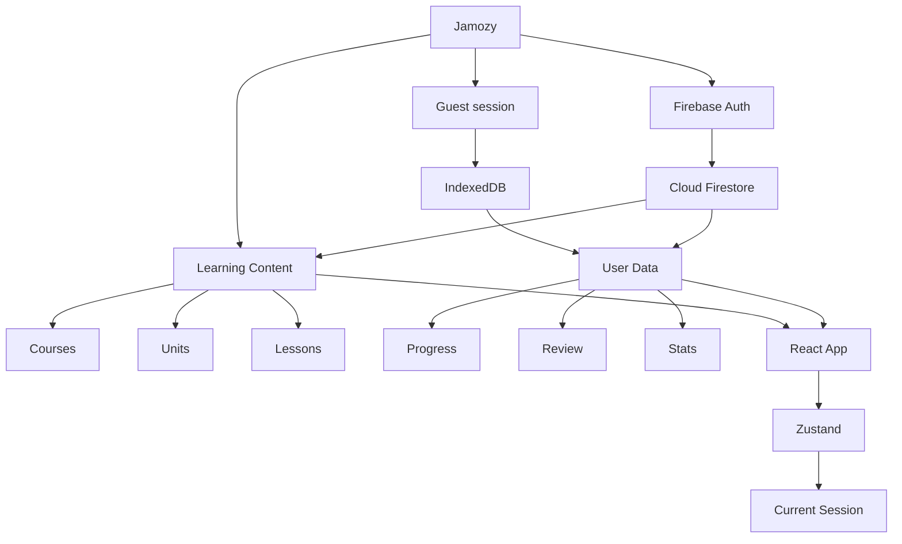

<h1>
  Jamozy
  
</h1>

[](https://react.dev/) [](https://www.typescriptlang.org/) [](https://vite.dev/) [](https://tailwindcss.com/) [](https://firebase.google.com/) [](https://zustand-demo.pmnd.rs/) [](https://motion.dev/) [](https://vitest.dev/) [](https://pnpm.io/) [](https://pages.cloudflare.com/) [](LICENSE)

> [!IMPORTANT]
> Jamozy is still _**under active development**_ and is not yet considered production-ready.
> Some features and data migrations are still in progress.

Jamozy is a web-based Korean typing learning app designed to help learners
become familiar with Hangul and the Korean keyboard through structured practice.

Learners progress from basic characters and syllables to words, phrases,
and sentences while improving typing accuracy and speed.

## Core Features

- Progressive Unit → Lesson learning structure
- One-page Home learning player with up to 10 exercises per selected course
- Korean typing exercises
- Virtual Korean keyboard guide
- Finger-placement reference for Korean keyboard practice
- Correct / incorrect typing feedback
- Accuracy and typing speed tracking
- Lesson results
- Review mistyped words
- Practice mode
- Learning progress tracking
- Simple EXP and Level system
- Guest-local or account-backed learning progress
- Configurable learning settings

## Learning Flow

Learn → Type → Review → Improve → Unlock

### Home One-page Learning Path

Home is the fast path into practice. It presents up to the first three courses
that are not finished; the learner chooses one course, then types a queue of
up to ten exercises in `Unit → Lesson → Exercise` order. A queue never fills
its remaining slots from another course.

The active exercise shows Korean, Thai/English meanings, romanization, live
WPM/accuracy, the virtual keyboard, and a finger-placement guide. Completing
an exercise saves a browser-local IndexedDB checkpoint, so a refresh resumes
at the next exercise. The checkpoint is local even for signed-in users and is
not cloud-synced or migrated. Only the final exercise of a lesson creates the
normal submitted lesson result, progress, EXP, and review effects.

The Hero and the standard learning-path cards remain below the player. Learners
can still open a Course and choose a specific Lesson through the existing flow.
When every available course is complete, Home falls back to replaying the first
three courses; completed lessons retain the existing lower replay EXP reward.

## Learning Modes

Jamozy separates learner experiences from reusable content and learner state:

```text
Experience                    Content                    Learner State
Daily Quest                   Course / Unit / Lesson     LessonProgress
Learning Path                 LessonExercise              VocabularyProgress
Practice: Topic / Position    Vocabulary / Topics         JamoStats / ReviewItem
                                                          DailyQuestProgress / UserProfile
                                                          LearningSession (history)
```

The structured `Course → Unit → Lesson → LessonExercise` hierarchy belongs only
to the Learning Path. Daily Quest and Practice Modes reuse shared vocabulary
and keyboard content; they do not unlock Learning Path lessons. See
[Learning Modes Architecture](docs/LEARNING-MODES.md) for target behavior and
implementation status.

Each submitted learning activity also creates a historical `LearningSession`.
It is separate from current learner state and lifetime `UserStats`; see
[Session and History Architecture](docs/SESSION-AND-HISTORY.md).

## Initial Scope

The first version focuses on the core Korean typing learning experience.

Guests use a required display name and device-local persistence. Learners who
create or sign in to an account use Email/password or Google Sign-In with
cloud-backed Firestore persistence. Authentication selects persistence; it does
not change learning behavior. See [Authentication and Persistence](docs/AUTH-AND-PERSISTENCE.md).

The MVP does not include multiplayer, leaderboards, social features, or other
competitive systems.

## Tech Stack

Frontend: React + TypeScript + Vite
Styling: Tailwind CSS
Routing: React Router
State Management: Zustand
Backend / BaaS: Firebase
Database: Cloud Firestore
Authentication: Firebase Authentication
Validation: Zod
Animation: Motion
Icons: Lucide React
Testing: Vitest + React Testing Library
Lint / Format: ESLint + Prettier
Deploy: Cloudflare Pages
Package Manager: pnpm

## Architecture


```mermaid
flowchart TD
    A[Jamozy]
    B[Guest session]
    C[IndexedDB]
    D[Firebase Auth]
    E[Cloud Firestore]

    F[Learning Content]
    G[User Data]

    H[Courses]
    I[Units]
    J[Lessons]

    K[Progress]
    L[Review]
    M[Stats]

    N[React App]
    O[Zustand]
    P[Current Session]

    A --> B
    B --> C
    A --> D
    D --> E
    A --> F

    E --> F
    C --> G
    E --> G

    F --> H
    F --> I
    F --> J

    G --> K
    G --> L
    G --> M

    F --> N
    G --> N

    N --> O
    O --> P
```

## Data Layer

```
UI / Pages
   ↓
Application / Use Cases
   ↓
Repository Interfaces
   ↓
Local Guest Repositories (IndexedDB)  |  Firebase Repositories (Firestore)
```

## Folder Structure

```
src/
├── domain/
│   ├── models/
│   │   ├── course.ts
│   │   ├── unit.ts
│   │   ├── lesson.ts
│   │   ├── progress.ts
│   │   └── review-item.ts
│   │
│   └── repositories/
│       ├── course-repository.ts
│       ├── lesson-repository.ts
│       ├── progress-repository.ts
│       └── review-repository.ts
│
├── application/
│   ├── get-course.ts
│   ├── get-lesson.ts
│   ├── complete-lesson.ts
│   ├── update-progress.ts
│   └── get-review-items.ts
│
├── infrastructure/
│   └── firebase/
│       ├── firebase.ts
│       ├── repositories/
│       │   ├── firebase-course-repository.ts
│       │   ├── firebase-lesson-repository.ts
│       │   ├── firebase-progress-repository.ts
│       │   └── firebase-review-repository.ts
│       └── mappers/
│           ├── lesson-mapper.ts
│           └── progress-mapper.ts
│
└── features/
    ├── lesson/
    ├── course/
    └── review/
```

## Theme Direction

### Core Theme

Jamozy follows a cozy and playful visual style inspired by soft pastel colors,
peaceful Korean-inspired scenery, and a relaxed learning atmosphere.

The interface is designed to feel friendly, calm, and approachable, with
rounded UI, gentle motion, and light game-like progression.

The overall goal is to make Korean typing practice feel warm, simple, and enjoyable.

### Visual Theme

Jamozy is built around a cozy and approachable learning experience.

Its visual direction combines soft pastel colors, rounded UI elements, and a
gentle game-like atmosphere inspired by peaceful Korean-style scenery, spring
gardens, and hand-drawn illustration tones.

The experience should feel calm, welcoming, and lightly playful rather than
intense or competitive.

#### Theme Keywords

```md
- Cozy
- Soft
- Calm
- Playful
- Pastel
- Friendly
- Peaceful
- Hand-drawn
```

#### Animation Direction

Animations should be subtle, smooth, and relaxing.

```md
Examples include:

- soft fade-ins
- gentle hover motion
- light button bounce
- smooth progress transitions
- subtle keyboard feedback
- small success highlights
- gentle error feedback
```

The goal is to support focus and comfort while making Korean typing practice
feel warm and enjoyable.

## About Jamozy

Jamozy is a simple and playful way to learn Korean typing.

It helps learners build familiarity with Hangul and the Korean keyboard through
progressive lessons, typing practice, and review.

Start with basic characters and syllables, then gradually move on to words,
phrases, and sentences while improving typing accuracy and speed.

Jamozy is designed to keep Korean typing practice focused, lightweight, and fun.

### Why the name Jamozy?

Jamozy comes from **Jamo (자모)**, the basic letters of Hangul, and **Cozy**.

The name represents a relaxed and approachable way to learn Korean typing,
starting from basic Hangul characters and gradually progressing to words,
phrases, and sentences.

## Getting Started

### Prerequisites

- Node.js
- pnpm
- Firebase project

### Installation

```bash
pnpm install
pnpm dev
pnpm build
pnpm test
```

## Environment Variables

```md
Create a `.env.local` file:
```

```env
VITE_FIREBASE_API_KEY=
VITE_FIREBASE_AUTH_DOMAIN=
VITE_FIREBASE_PROJECT_ID=
VITE_FIREBASE_STORAGE_BUCKET=
VITE_FIREBASE_MESSAGING_SENDER_ID=
VITE_FIREBASE_APP_ID=
VITE_FIREBASE_USE_EMULATOR=0
```

> Never commit Firebase environment files containing project-specific configuration or secrets.

## Firestore Data Model

Learning content collections are shared by both learner modes. The `users` tree
is authenticated learner state only; the equivalent Guest state is stored in
IndexedDB. See [Authentication and Persistence](docs/AUTH-AND-PERSISTENCE.md).

```text
courses/{courseId}
units/{unitId}
lessons/{lessonId}
vocabulary/{vocabularyId}
topics/{topicId}

users/{userId} (authenticated Firebase Auth UID only)
users/{userId}/lessonProgress/{lessonId}
users/{userId}/vocabularyProgress/{vocabularyId}
users/{userId}/jamoStats/{jamoId}
users/{userId}/reviewItems/{itemId}
users/{userId}/dailyQuestProgress/{dateKey}
```

> Learning content and user progress are stored separately.

Progress documents are created lazily: a missing `lessonProgress` document means a lesson is locked. Persisted states are `unlocked` and `completed`. Learning order is `Course.order → Unit.order → Lesson.order`; document IDs do not determine which lesson unlocks next. Guest learner state has the same domain shape but is stored in IndexedDB, not in Firestore.

For document-backed domain entities, the domain `id` is the Firestore document ID and is not duplicated in document data. Embedded exercise IDs and Progress's `lessonId` follow the exceptions documented in `docs/DOMAIN-MODEL.md`.

## Content Credits

Vocabulary sources, attribution, and licenses are recorded in [docs/CREDITS.md](docs/CREDITS.md) before their data is imported.

Current sources:

- Korean-English Learners' Dictionary vocabulary list (5,800 words),
  National Institute of Korean Language (국립국어원) —
  <https://www.korean.go.kr/front_eng/down/down_02V.do?etc_seq=71&pageIndex=1>
- 현대 국어 사용 빈도 조사 2, National Institute of Korean Language (국립국어원)

> Lesson content is treated as shared application data, while progress, review
> history, EXP, levels, and statistics belong to individual users.

## Project Status

The core MVP is functionally complete: Learning Path, lessons, results,
review, guest and authenticated persistence, settings, profile, and Admin BO
are implemented. The Home one-page Learning Path player is awaiting its final
manual verification pass. See the [Progress Tracker](docs/PROGRESS.md) for
the detailed current status.

### MVP

MVP is complete apart from final user-owned verification of the Home one-page
Learning Path player. See [Progress Tracker](docs/PROGRESS.md) for the
verification checklist and post-MVP roadmap.

### Next / Post-MVP

- Complete the Home one-page Learning Path player's manual verification.
- Set up a Cloudflare Pages deployment pipeline and use Preview deployments
  for release checks.
- Decide whether sound feedback ships or is deferred, then implement the
  selected behavior
- Dark-mode CSS
- Dedicated Lesson Result visual redesign
- History, summaries, and analytics
- Learning Modes: VocabularyProgress, JamoStats, Practice, and Daily Quest
- Roll out per-step Jamo SVG rendering: it is built behind the
  `VITE_JAMO_SVG_RENDERER` flag with 1,858 approved syllables (DEC-039).
  First validate it in a Preview deployment, including mobile, resolve the
  space-target policy, and raise lesson-vocabulary coverage before enabling it
  for learners. See the
  [Progress Tracker](docs/PROGRESS.md#dev-tooling-jamo-svg).
- Account linking between authentication providers
- Achievements, daily streaks, pronunciation audio, and additional curriculum

### Admin BO operator checklist

The application includes a single-owner `/admin` authoring interface. It is
not enabled by navigation alone: Firestore Rules require an Auth token with
`admin: true`. Before rollout, deploy `firestore.indexes.json`, then run the
status migration with a local service-account credential:

```bash
pnpm content:migrate-status -- --dry-run
pnpm content:migrate-status -- --write --after-dry-run
pnpm admin:grant -- <firebase-auth-uid>
```

Deploy the restrictive Rules only after the migration count is verified. The
owner must sign out and back in after the claim is granted. The scripts use
`GOOGLE_APPLICATION_CREDENTIALS` from `.env.local`; do not place a service
credential in `VITE_*` variables or commit it.

Run the Rules authorization suite with `pnpm test:rules`. It starts a local
Firestore Emulator, never contacts the Firebase project, and requires the
Firebase CLI and Java to be available on the developer machine.

## Development Principles

- Keep Firebase access outside React UI components.
- Access persisted data through repository interfaces.
- Keep typing-session state in client state, not Firestore.
- Avoid Firestore writes for individual keystrokes.
- Persist lesson results only at meaningful checkpoints.
- Keep learning content separate from user progress.
- Prefer small, focused features over unnecessary gamification.
- Keep the learning experience calm, lightweight, and approachable.

---

© _2026 Namchok Singhachai_. Jamozy is released under the MIT License.
